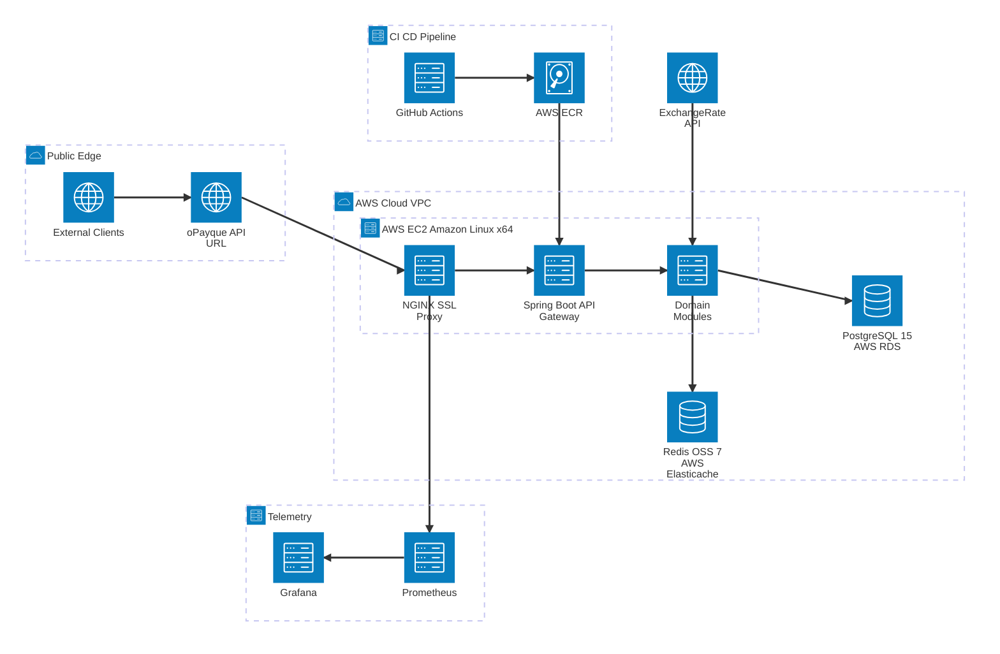
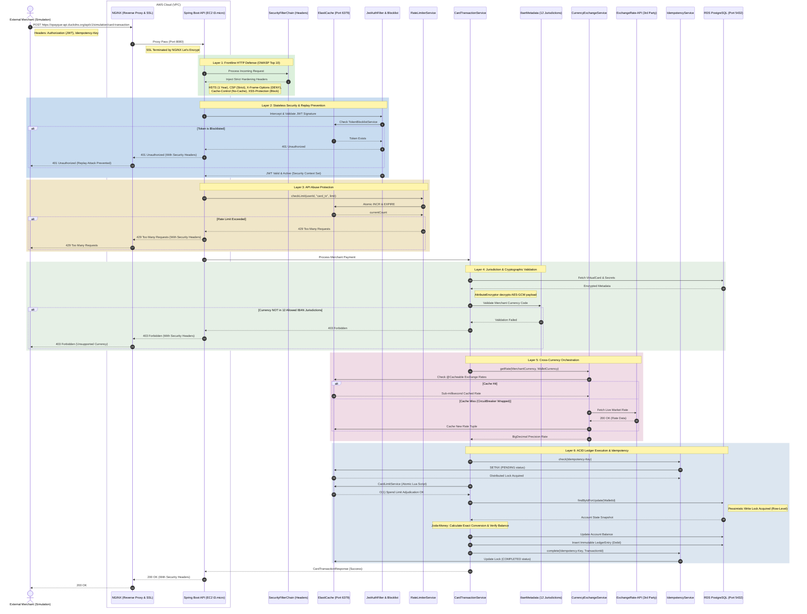
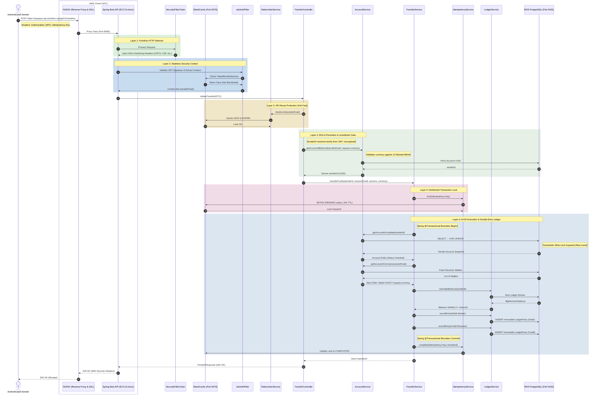
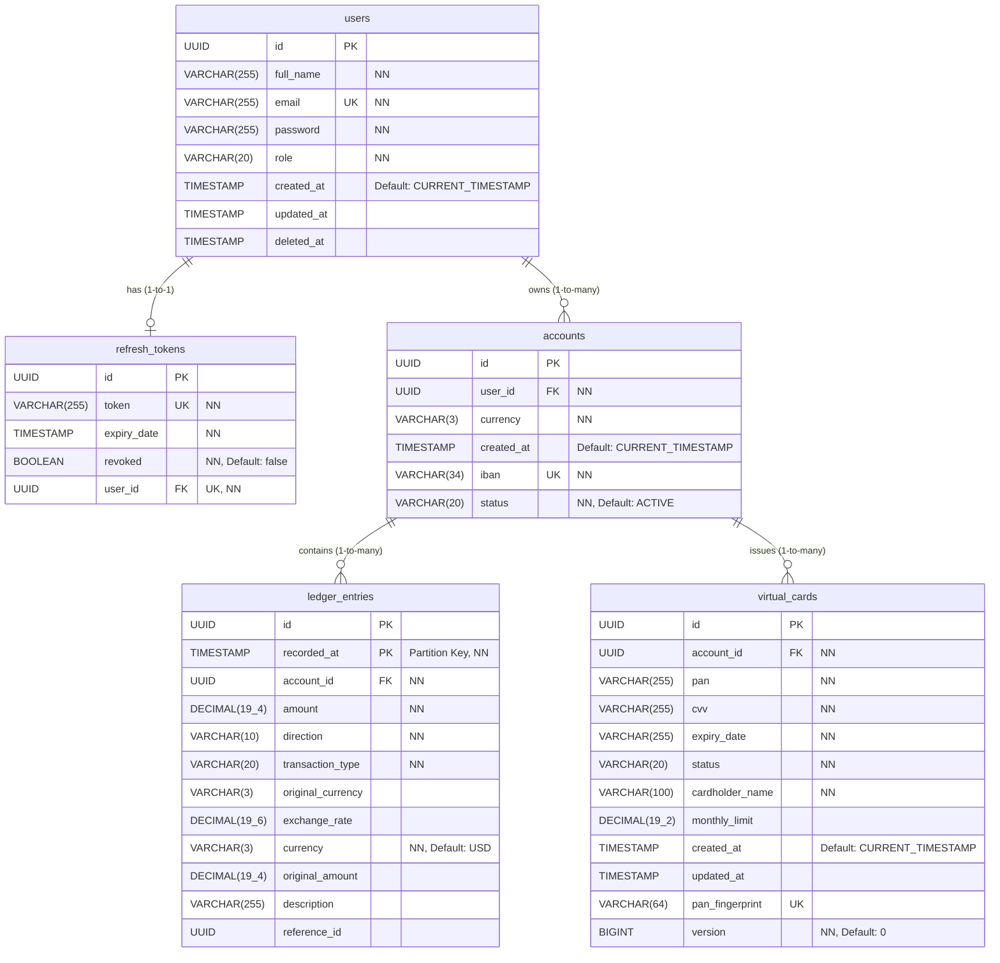

<div align="center">
  


  # oPayque Core Banking & Digital Wallet API
  
  **A production-grade highly secure, scalable, double-entry immutable financial ledger and virtual card issuance engine.**
  
  [](https://adoptium.net/)
  [](https://spring.io/projects/spring-boot)
  [](https://www.postgresql.org/)
  [](https://redis.io/)
  
  [](https://aws.amazon.com/)
  
  
  
  
  
  
  
  
  
  [](https://github.com/your-username/opayque)
  [](https://opensource.org/licenses/Apache-2.0)
</div>

---

## Executive Summary

The **oPayque Core Banking API** is a rigorously engineered backend system designed to simulate the complex operations of a modern digital bank. Built over two months of intensive development, this API moves beyond standard CRUD operations to tackle the hardest problems in distributed financial systems: **ACID-compliant money movement, concurrent state mutation, and PCI-DSS-aligned cryptographic security.**

Currently deployed live on **AWS EC2**, sitting behind an **NGINX reverse proxy** with Let's Encrypt SSL termination, the API acts as the secure gateway to a heavily guarded financial ecosystem. 

> 🛡️ **Zero-Compromise Engineering:** The entire system is governed by a suite of **662 automated tests**, including deep integration testing, E2E Testing, Property-Based Testing, ArchUnit boundary enforcement, and heavy concurrency stress-testing vector suites (exhaustion, chaos, and contention) achieving **100% code coverage**.

### Core Value Proposition

* **Immutable Ledger & Double-Entry Bookkeeping:** Utilizes pessimistic row-level locking (`SELECT ... FOR UPDATE`) in PostgreSQL alongside `Joda-Money` to ensure zero-precision-loss and absolute protection against double-spend attacks.
* **Military-Grade Cryptography:** Features a custom `AttributeEncryptor` leveraging **AES-GCM** encryption and **HMAC-SHA256** blind indexing to secure sensitive Virtual Card PANs and CVVs at rest.
* **Distributed Resilience:** Orchestrates a robust Redis ecosystem to power an `IdempotencyService` (preventing replay attacks/duplicate charges), an atomic $O(1)$ `CardLimitService` using custom Lua scripts, and a global `RateLimiterService`.
* **Strict Jurisdictional Compliance:** The engine strictly isolates transfers and transactions to **10 carefully regulated IBAN jurisdiction currencies** (defined natively via `IbanMetadata`), rejecting unsupported regional tenders at the security perimeter. 
* **Cloud-Native Observability:** Instrumented with Micrometer and monitored in real-time via a custom **Prometheus & Grafana** telemetry stack, complete with PII-masked application logging.

---

# I. Core Domains & Architecture (Epic Breakdown)

The oPayque API abandons standard layered architecture in favor of strict **Domain-Driven Design (DDD)**. The system is structurally partitioned into five highly cohesive, decoupled domains (Epics). This bounded-context approach ensures that the high-throughput Redis limit checks in the Card domain do not bleed into the pessimistic locking mechanisms of the Core Ledger. 

The architecture is explicitly enforced via an extensive **ArchUnit** test suite, guaranteeing zero domain leakage or cyclic dependencies across the transaction boundaries.

### High-Level Domain Summary

| Domain / Epic | Primary Responsibility | Core Technologies & Patterns |
| :--- | :--- | :--- |
| **1. Identity & Access Management** | Secure onboarding, stateless authentication, strict user-to-wallet resource isolation, and foundational PII data masking across all application logs. | JWT, Redis Token Blocklist, RBAC, BOLA Guards, Bcrypt, PII-Masking Converter. |
| **2. Core Wallet & Ledger Engine** | Multi-currency account provisioning and immutable double-entry bookkeeping. | PostgreSQL, `Joda-Money`, Optimistic Locking, Ledger Partitioning, `Rest-Client`, ISO 4217 & IBAN Validation. |
| **3. Transaction & Transfer Gateway** | ACID-compliant peer-to-peer money movement and concurrent balance aggregation. | PostgreSQL Row-Level Pessimistic Locking, Redis Idempotency. |
| **4. Virtual Card Ecosystem** | PCI-DSS aligned card provisioning, cryptographic storage, $O(1)$ authorization limits, and live cross-currency merchant payment orchestration. | AES-GCM Encryption, HMAC-SHA256, Redis Lua Scripts, ExchangeRate-API, Resilience4j Circuit Breaker, Spring `@Cacheable`. |
| **5. Administration & Observability** | Lifecycle governance, statement generation, and real-time cloud telemetry. | Micrometer, Prometheus, Grafana. |

## Epic 1: Identity & Access Management (The Trust Layer)

The oPayque API implements a strict **Zero-Trust, Stateless Security Architecture**. Recognizing that authentication is the most critical vector in financial applications, this domain goes far beyond simple token generation. It enforces defense-in-depth from the HTTP perimeter down to the persistence layer, strictly aligning with **OWASP API Security Top 10** guidelines.

> 🏛️ **Design Philosophy:** Never trust the client. Never trust the network. Never log the plaintext.

### Frontline HTTP Defense (OWASP Compliance)
Before a request even reaches the authentication filter, the `SecurityConfig` enforces rigorous browser-side constraints to neutralize common attack vectors:
* **Strict-Transport-Security (HSTS):** Enforces HTTPS-only communication across all subdomains for 1 year (`maxAgeInSeconds = 31536000`), neutralizing SSL-downgrade and MITM attacks.
* **Content Security Policy (CSP):** `default-src 'self'; frame-ancestors 'none';` halts cross-site scripting (XSS) at the browser execution level.
* **X-Frame-Options (DENY):** Provides absolute immunity against UI redressing and Clickjacking.
* **No-Cache Directives:** Prevents sensitive financial payloads (like account balances or encrypted secrets) from being cached on client disks or intermediate proxy servers.

### Cryptographic Identity & Dual-Token Strategy
User registration and session management are handled with uncompromising cryptographic standards:
* **BCrypt Password Hashing:** Credentials are one-way hashed before persistence. The `AuthService` enforces a strict "Soft Delete" policy, preventing active account duplication.
* **Dual-Token Rotation:** Upon login, users receive a short-lived temporal **Access Token (JWT)** and a high-entropy opaque **Refresh Token**.
* **Single Active Session (SAS):** Initiating a new session automatically revokes the antecedent refresh token. Token rotation invalidates the previous token string, severely narrowing the window for token-theft exploitation.

### Stateless Logout & Replay Attack Prevention
Traditional JWTs cannot be invalidated before their natural expiration. oPayque solves this distributed systems problem using a **Redis-backed Kill Switch**:
* **The Blocklist Engine:** When `/api/v1/auth/logout` is called, the `AuthService` extracts the unique HMAC signature of the JWT and pushes it to Redis via the `TokenBlocklistService`.
* **Memory-Optimized TTLs:** Only the signature (not the full token) is stored. Redis is configured with an exact TTL matching the token's remaining lifespan, ensuring an auto-purging, $O(1)$ lookup blocklist that completely neutralizes Replay Attacks without bloating cache memory.

### BOLA Shield & RBAC Guardrails
Broken Object Level Authorization (BOLA) is the #1 API vulnerability. oPayque eliminates this threat fundamentally at the controller level:
* **Strict Context Resolution:** Endpoint logic *never* accepts a `senderId` or `userId` from the request body. Instead, the identity is cryptographically extracted directly from the validated JWT Principal (e.g., `authentication.getName()`).
* **Role-Based Access Control (RBAC):** Privileged endpoints (`/api/v1/admin/**` and Actuator telemetry) are strictly locked behind the `ADMIN` authority boundary. 

### PCI-DSS Aligned Log Sanitization
To ensure operational compliance and protect user privacy, the API intercepts its own telemetry before it leaves the application context:
* **Regex-Powered PII Masking:** A custom Logback `PiiLoggingConverter` acts as a surgical filter. Using lookbehind and lookahead regex, it detects structured Personally Identifiable Information (PII) like email addresses in the application logs.
* **Context Preservation:** It truncates the local part of the email while preserving the domain (e.g., `dev@opayque.com` becomes `d***@opayque.com`). This ensures the logs remain highly useful for DevOps debugging while completely shielding the user's actual identity from persistent storage.

## Epic 2: Core Wallet & Ledger Engine (The Immutable Truth)

Most standard applications track financial state using a mutable `balance` column. This is a critical anti-pattern in high-concurrency systems, leading to lost updates, race conditions, and catastrophic data desynchronization. 

oPayque Abandons the mutable balance in favor of an **Event-Sourced, Append-Only Ledger**. The system derives the absolute truth dynamically, treating every transaction as a mathematically pure, immutable event.

### The Immutable Double-Entry Ledger
The core of the financial engine resides in the `LedgerService` and the `@Immutable` `LedgerEntry` entity.
* **Dynamic Balance Aggregation:** Balances are never "updated." Instead, the `LedgerRepository` executes a real-time, zero-sum aggregation (`SELECT SUM(CASE WHEN type = CREDIT THEN amount ELSE -amount)`) to calculate the exact available funds at that microsecond.
* **PostgreSQL Index-Only Scans:** To ensure this dynamic aggregation remains lightning-fast even with millions of rows, the database utilizes a native covering index (`idx_ledger_covering` on `account_id, transaction_type, amount`). This forces PostgreSQL to execute the math entirely within the index memory, bypassing expensive table Heap fetches.
* **Native Partitioning & Streaming:** By utilizing native PostgreSQL partitioning on the `recorded_at` column rather than heavy extensions like TimescaleDB, the system avoids vendor lock-in. High-volume statement exports utilize Spring Data's forward-only `Slice` to bypass massive `COUNT()` overhead on deep ledger pages.

### Zero-Precision-Loss with Joda-Money
Standard `Double` or `Float` primitives are mathematically dangerous for financial systems due to floating-point rounding errors. 
* **Joda-Money Engine:** The `LedgerService` delegates all cross-currency math and balance mutations to the `Joda-Money` library.
* **Scale Enforcement:** Values are strictly bound to `BigMoney` objects, parsed, converted, and persisted with a rigid database schema scale of 4 (`precision = 19, scale = 4`) using `RoundingMode.HALF_EVEN` (Banker's Rounding) to guarantee absolute mathematical perfection across high-volume ledgers.

### Bank-Grade Provisioning & Cryptographic Validation
To operate as a true Neobank, the system must generate universally recognized financial identifiers capable of passing external validation engines.
* **ISO 13616 IBAN Generation:** The `IbanGeneratorImpl` is responsible for manufacturing mathematically valid International Bank Account Numbers. It programmatically derives the check digits based on the specific country code and our internal institution routing logic, ensuring every provisioned wallet complies with global financial messaging standards.
* **Custom Institutional BIN:** oPayque operates on its own dedicated 6-digit Bank Identification Number (BIN) prefix: **`171103`**. This custom routing prefix structurally identifies all issued virtual cards as originating from the oPayque ecosystem.
* **Luhn Algorithm Checksums:** Before any Virtual Card is persisted or authorized, the `LuhnAlgorithm` utility enforces a strict Modulus 10 checksum validation. This mathematically guarantees the structural integrity of the 16-digit Primary Account Number (PAN), neutralizing accidental miskeys and preventing corrupted card data from polluting the database.

### Concurrent State Mutation (Pessimistic Locking)
When simulating chaotic network environments, multiple debits might hit the same wallet simultaneously. oPayque handles this without distributed deadlocks:
* **Row-Level Write Locks:** Before a ledger entry is processed, the `AccountService` drops a strict pessimistic write lock (`SELECT ... FOR UPDATE`) on the specific PostgreSQL account row.
* **Optimistic Retry Backoff:** To absorb extreme transient contention spikes, the persistence layer is wrapped in a Spring Retry mechanism (`@Retryable`). It automatically utilizes exponential backoff to handle up to 12 collision attempts, seamlessly queuing 50+ concurrent threads without dropping a single connection.

### Multi-Currency Sub-Wallets & ISO 20022 Compliance
The API acts as a global territorial gateway, allowing users to provision specific sub-wallets dynamically.
* **The 1:1 Jurisdictional Rule:** A user is strictly limited to one active wallet per supported ISO 4217 currency (e.g., EUR, GBP) to prevent database sprawl.
* **Strict IBAN Filtering:** The ecosystem is hard-locked to exactly 10 specific IBAN jurisdictions (managed via `IbanMetadata`). Any attempt to provision a wallet or execute a transfer outside these legally permitted bounds is rejected at the security perimeter. 
* **Standardized Messaging:** Internal entity namings and JSON payloads (`IBAN`, `BIC`, `amount`, `currency`) are strictly aligned with ISO 20022 global financial messaging standards, ensuring seamless future integrations with real-world banking rails.
* **Synchronous Simplicity:** External cross-currency exchange rates are fetched synchronously using the modern `RestClient` rather than the heavier `WebClient`, optimizing the execution footprint for blocking operations within the `@Transactional` boundary.

<br>

<p align="center">


</p>

<p align="center"><em>Figure - oPayque Bank Supported currencies</em>

<br>

<div align="center">

| Code | Currency (full name) | Country / Primary issuer |
|------|----------------------|---------------------------|
| EUR  | Euro | Eurozone (e.g., Germany, France, Italy, Spain, Netherlands, Belgium, etc.) |
| GBP  | British Pound Sterling | United Kingdom |
| CHF  | Swiss Franc | Switzerland (and Liechtenstein) |
| PLN  | Polish Złoty | Poland |
| NOK  | Norwegian Krone | Norway |
| DKK  | Danish Krone | Denmark (including Greenland & the Faroe Islands) |
| SEK  | Swedish Krona | Sweden |
| CZK  | Czech Koruna | Czech Republic |
| HUF  | Hungarian Forint | Hungary |
| RON  | Romanian Leu | Romania |

</div>


## Epic 3: Transaction & Transfer Gateway (The ACID Engine)

Peer-to-Peer (P2P) fund transfers are the most critical operations in a financial system, susceptible to race conditions, network partition retries, and authorization bypass attacks. The oPayque `transactions` domain is engineered to handle these edge cases with absolute, mathematically proven atomicity.

### The BOLA Shield & Context Resolution
Broken Object Level Authorization (BOLA) attacks frequently target transfer endpoints by manipulating the `senderId` in JSON payloads. oPayque neutralizes this fundamentally at the `TransferController` API Gateway:
* **Payload Ignorance:** The API entirely ignores identity claims in the request body. Instead, it extracts the sender's email cryptographically from the validated Spring Security JWT Principal.
* **Strict Wallet Resolution:** Using the `AccountService`, the engine cross-references the authenticated email with the requested ISO 4217 currency, securely returning the internal UUID of the wallet only if the user holds authorized ownership of that specific jurisdictional account.

### Distributed Idempotency (At-Least-Once Safety)
In mobile environments, dropped connections often result in clients retrying the same payment request. Without guardrails, this causes double-charging. 
* **Redis `SETNX` Locks:** The gateway strictly requires an `Idempotency-Key` HTTP header. The `IdempotencyService` utilizes Redis atomic operations to place a distributed lock on this key with a 24-hour TTL.
* **State Machine Guard:** If a second identical request hits the API while the first is processing, the system rejects it immediately. Once the transaction completes, the lock is updated to a `COMPLETED` state, permanently shielding the ledger from duplicate execution.

### 🏦 ACID Execution & The Same-Currency Corridor
The actual money movement occurs within a heavily guarded `@Transactional` boundary governed by the `TransferService`:
* **Pessimistic Serialization:** The engine drops a strict database-level pessimistic write lock (`@Lock(LockModeType.PESSIMISTIC_WRITE)`) on the sender's account. This serializes concurrent debits and prevents "lost updates" when a user attempts to execute multiple rapid-fire transfers.
* **Real-Time Spend Adjudication:** The system calculates the sender's available balance by dynamically querying the `LedgerService` for an up-to-the-millisecond zero-sum aggregation, bypassing mutable caching entirely.
* **Corridor Validation:** P2P transfers are strictly isolated. The system dynamically queries the beneficiary's portfolio for a wallet that exactly matches the 1:1 requested currency. No live Forex conversion occurs here; if the beneficiary lacks the corresponding IBAN jurisdictional wallet, the transaction fails safely.
* **Atomic Dual-Ledgering:** Upon successful validation, the engine persists two immutable `LedgerEntry` records (one `DEBIT` for the sender, one `CREDIT` for the receiver), binding them together with a shared `transferId` reference to ensure perfect, auditable double-entry accounting.

### API Abuse Protection (Fail-Fast Traffic Control)
Before any database connections or locks are acquired, the `TransferController` routes the request through the `RateLimiterService`. This globally distributed Redis quota ensures that rapid, malicious brute-force attempts to drain an account result in a fast HTTP 429 response, protecting the core database from connection exhaustion.

## Epic 4: Virtual Card Ecosystem (The Crown Jewel)

The Virtual Card domain is the most heavily fortified segment of the oPayque API. Handling Cardholder Data (CHD) and Sensitive Authentication Data (SAD) requires absolute adherence to **PCI-DSS and OWASP ASVS 8.x** standards. 

To achieve this, the application eschews standard database-level encryption in favor of a highly sophisticated, custom-built application-level cryptography engine: the `AttributeEncryptor`.

### Military-Grade Cryptography: The `AttributeEncryptor`
Why did we build a custom crypto-engine instead of relying on AWS KMS or RDS TDE (Transparent Data Encryption)? Because TDE only protects data at rest (on the disk). If the database is compromised via SQL injection or unauthorized access, the engine decrypts the data transparently for the attacker. 

oPayque implements **Envelope Encryption at the Application Layer**. The PostgreSQL database never sees the plaintext PAN, CVV, or Expiry Date; it only stores mathematically secure ciphertext.

#### The Cryptographic Blueprint
* **Algorithm:** `AES/GCM/NoPadding` (Advanced Encryption Standard in Galois/Counter Mode). GCM provides Authenticated Encryption with Associated Data (AEAD), meaning it guarantees both **Confidentiality** (data is hidden) and **Integrity** (data cannot be tampered with). Any bit-flipping attack results in an `AEADBadTagException`.
* **Key Derivation (PBKDF2):** Keys are not stored directly. They are derived from externalized passphrases using `PBKDF2WithHmacSHA256` heavily stretched with **100,000 iterations**. This renders GPU brute-force attacks computationally infeasible.
* **Immutable Salting:** The derivation utilizes a hardcoded, deterministic salt prefix (`OPAYQUE_MIASMA_SALT`) bound to the key version, ensuring consistent key regeneration without re-encrypting historical data.

The resulting ciphertext is a concatenated byte buffer, Base64-encoded for safe database storage:
```math
\text{Payload} = \text{Version Byte [1]} \parallel \text{Random IV [12]} \parallel \text{Ciphertext} \parallel \text{Auth Tag [16]}
```

### Zero-Downtime Key Rotation

Financial compliance mandates periodic cryptographic key rotation. oPayque achieves zero-downtime rotation via the embedded **Version Byte**.

* The `OpayqueSecurityProperties` injects a map of sequential `versionId`s to passphrases.
* The `activeVersion` designates the key used for all *new* encryption operations.
* During decryption, the engine reads the first byte of the payload to dynamically select the correct historical key from the `keyStore`, allowing a seamless cryptoperiod overlap without breaking active cards.

### Deterministic Blind Indexing

A fundamental crypto-problem: *If the PAN is encrypted with a randomized IV every time, how do we check if a PAN already exists in the database without decrypting millions of rows?*

oPayque solves this with a **Blind Index** (`pan_fingerprint`).

* Before persistence, the entity passes the plaintext PAN through an irreversible `HmacSHA256` hashing function, keyed with a separate, highly guarded `hashingKey`.
* This produces a deterministic 64-character hexadecimal fingerprint.
* The database executes $O(1)$ lookups against the `uk_virtual_card_pan_fingerprint` constraint, achieving perfect searchability without ever exposing the reversible PAN.

### $O(1)$ Redis Spend Adjudication

To authorize merchant card swipes in milliseconds, the `CardLimitService` acts as the "Ledger-Side Limit-Control Chain".

* **Atomic Lua Scripts:** Rather than fetching a balance, checking it, and updating it (which causes race conditions), oPayque pushes a custom Lua script (`LUA_LIMIT_CHECK`) directly into Redis. Redis evaluates the entire Read-Compare-Increment-Expire operation as a single, indivisible atomic unit.
* **Sliding TTLs:** The script tracks spends against a key formatted as `spend:{cardId}:{yyyy-MM}` with a 32-day sliding TTL (`KEY_TTL_DAYS = 32`). This mathematically guarantees that monthly limits automatically reset on the 1st of every month, eliminating the need for fragile background batch jobs.

### Saga-Lite Compensating Transactions

The transaction engine follows a strict "Spend first, record second" orchestration.

1. The requested amount is atomically reserved in Redis.
2. The system attempts to acquire the pessimistic database lock and execute the ACID ledger entry.
3. **The "Zombie" Defense:** If the database write fails (e.g., connection drop, deadlock), the `CardTransactionService` catches the failure and fires `cardLimitService.rollbackSpend`. This compensating transaction returns the funds to the Redis available limit, ensuring perfect consistency between the high-speed cache and the persistent ledger.

### Cross-Currency Orchestration & Resilience
To support seamless international merchant payments, the virtual card engine relies on real-time Forex data. Integrating with third-party systems like the **ExchangeRate-API** introduces network unpredictability, which oPayque mitigates using a layered, fail-fast resilience strategy.

* **Sub-Millisecond Caching:** The engine utilizes Spring's `@Cacheable` abstraction (backed by Redis) to store currency pairs (e.g., `EUR-GBP`). This eliminates external network hops for repeated currency pairs, delivering sub-millisecond latency for the transaction engine while strictly preserving external API quotas.
* **Resilience4j Circuit Breaker:** The synchronous `RestClient` call to the external Forex provider is wrapped in a Resilience4j `CircuitBreaker`. If the ExchangeRate-API experiences an outage or severe latency degradation, the circuit trips open (`CallNotPermittedException`). This instantly blocks subsequent outbound requests, preventing cascading thread exhaustion from bringing down the core banking API.
* **Graceful Degradation:** The manual fallback handler explicitly catches and categorizes integration failures. It cleanly separates systemic outages (`ServiceUnavailableException` - HTTP 503) from business logic violations (`IllegalArgumentException` - HTTP 400), ensuring the API's REST semantics remain perfectly compliant even under duress.
* **Strict Type Safety:** All fetched rates are immediately coerced into `BigDecimal` objects, guaranteeing that downstream ledger math never falls victim to floating-point truncation.

## Epic 5: The Observer & Administration (The View from the Top)
A critical feature of any enterprise-grade application is its observability and lifecycle management. The `admin` and `statement` domains ensure that the oPayque API provides transparent, performant access to data for both users and system operators, alongside robust cloud-native telemetry for proactive monitoring. Beyond standard system health, the oPayque API provides granular visibility into its internal execution logic via real-time code instrumentation.

### Transaction Statements & Streaming
To support heavy financial reporting, generating transaction statements needs to handle large volumes of data without causing memory issues.
* **Forward-Only Slicing:** The `LedgerRepository` abandons the traditional Spring `Pageable` component for `Slice`. A standard `Page` implementation executes an expensive `COUNT()` query across the entire ledger to calculate total pages. Utilizing a `Slice` bypasses this, fetching only the requested chunk and a boolean indicating if a subsequent chunk exists, which significantly reduces the database workload during large CSV exports.
* **Rapid Chronological Sorting:** The query relies heavily on the `idx_ledger_recorded_at` index, enabling PostgreSQL to fetch ranges of financial movements incredibly fast without relying on sequential table scans.

### Cloud-Native Telemetry & Dashboards
The API deployment on AWS is monitored in real time using a custom-built telemetry stack.
* **Prometheus Actuator:** The application surfaces key JVM metrics (like CPU usage) via the Spring Boot `/actuator/prometheus` endpoint.
* **Secure Scrape Mechanism:** The `prometheus.yml` configuration is built to navigate the secure Let's Encrypt `HTTPS` endpoint, utilizing a dynamic `bearer_token_file` to authenticate its requests to the AWS EC2 instance.
* **Bespoke Grafana Visualizations:** Instead of relying on generic templates, the `opayque-api-telemetry.json` provisions a dashboard directly tailored to the custom metrics.
* **Micrometer `@Timed` Instrumentation:** Critical execution paths—such as the P2P transfer orchestrator and the AES-GCM encryption/decryption cycles—are annotated with `@Timed`. This directly pipes method-level invocation counts and latency distributions (e.g., $p95$, $p99$ response times) to Prometheus, allowing the Grafana dashboard to instantly visualize performance bottlenecks in the core logic.

### The Administrator Domain
The `admin` boundary acts as a high-security enclave for system management tasks, locked firmly behind the `ROLE_ADMIN` guard.
* **Account Lifecycle Governance:** Through `AccountService`, an administrator can update the status of accounts using a rigid state machine. A user may not freeze their own account; it is a privileged action. Furthermore, the system denies impossible state transitions (e.g., changing a `CLOSED` account back to `ACTIVE`).
* **Liquidity Seeding:** To facilitate testing and system management, the `AdminWalletService` enables forced currency deposits directly into user ledgers.
* **The Soft-Delete Pattern:** The persistence layer adheres to banking data retention standards. Entities such as the User identity are never executed via an `SQL DELETE` and also prohibited from implementing `DELETE` repository methods at service layers with the help of ArchUnit Guardrails. They utilize an `isDeleted` flag or timestamp (e.g., `deletedAt`) to remove the entity from active queries while retaining the immutable audit history for regulatory compliance. 

---

# II. Architectural Design & System Topography

The architecture of oPayque natively blends **Domain-Driven Design (DDD)** principles with **Cloud-Native Scalability**. By utilizing an isolated, multi-layered ecosystem design backed by robust distributed safeguards and extensive system verifications, oPayque functions effectively under severe concurrency loads.

### Cloud Architecture Ecosystem 



### Domain-Driven Design (Bounded Contexts)
The system rejects monolithic "Big Ball of Mud" scaling issues in favor of tightly decoupled boundaries:
* **The Domains:** Logic is divided strictly into `identity`, `wallet`, `transactions`, `card`, and `admin` code bundles. Check `src/main/java/com/opayque/api` packages for structural segregation.
* **ArchUnit Boundary Enforcement:** It’s easy to accidentally couple domains (e.g., the `wallet` layer directly fetching the `SecurityContext`). To prevent "domain leakage", oPayque enforces constraints mathematically via comprehensive `ArchUnit` testing routines. If the `wallet` layer attempts to directly poll the HTTP boundary logic rather than depending strictly on the `identity` or core service components, the build fundamentally fails `mvn verify`.

### The Saga-Lite Pattern
Distributed databases and high-speed cache nodes run the real-world risk of partial failures where one database commits its result while another aborts.
* OPayque implements a **Compensating Transaction Saga-Lite Strategy**.
* When a merchant requests a swipe operation:
  1.  oPayque first secures the spend request within the Redis $O(1)$ limit checker.
  2.  Then, it executes the strict PostgreSQL immutable debit entry execution.
  3.  If the PostgreSQL write fails (deadlock timeout, external network crash), a specialized catch block immediately rolls back the Redis operation and issues an HTTP 500 error, guaranteeing absolute synchronization and preventing "zombie authorizations" where limits are locked out despite the core ledger aborting.

### Software Delivery Lifecycle & TDD
This project was driven by a robust CI/CD integration focus.
* **Agile Kanban Management:** Delivery was organized efficiently utilizing GitHub Projects to track sprint items over 5 distinct, high-impact Epics.
* **Test Driven Development (TDD) Mastery:** Producing flawless banking math requires extensive proof logic.
    * The system includes **662 individual tests** achieving **100% test coverage** code assurance.
    * Uses high-quality verification tools (Testcontainers to spin up accurate `Postgres` and `Redis` nodes in integration paths, Rest Assured for HTTP endpoints validation, Wiremock for Forex integrations, Mockito for service-level abstraction logic).
    * Specifically executes deep contention, chaos, and exhaustion vectors against the logic.

---

# III. API Sequence Flows & Ecosystem Dynamics

The internal execution engine of oPayque natively blends extreme state-safety guardrails (Redis) with precise financial accounting boundaries (Joda-Money). The following trace sequences highlight exactly how oPayque securely governs state under heavy concurrent load. 

### Merchant POS Transaction Lifecycle

The complexity of processing an external merchant payment in real-time requires a rigorous and mathematically-proven state execution plan. 




#### The Cross-Currency POS Request Trace 

1. **Frontline Defenses (Layers 1 & 2):** * Every request must pass the `SecurityFilterChain` which enforces non-negotiable OWASP standard constraints (HSTS, CSP, X-Frame-Options, XSS, and No-Cache) ensuring that banking data payloads are never locally persisted in transit.
    * Authentication utilizes the `TokenBlocklistService` (Redis-backed). If the JWT signature is actively identified in the blocklist (a logout execution), the attempt is aborted, entirely neutralizing Replay Attacks.
    * A secondary Redis traffic gate, the `RateLimiterService`, limits card transactions to exactly 20 invocations per minute to immediately halt targeted Brute-Force limit attacks.

2. **Validation & Decryption (Layer 3):**
    * The engine utilizes a $O(1)$ Hash lookup relying on a deterministic `HMAC-SHA256` Blind Index to locate the Virtual Card within PostgreSQL securely.
    * The system securely extracts the AES-GCM encrypted PAN/CVV directly from the data layer to cross-reference the incoming request without ever violating PCI-DSS requirements.
    * Only the 12 verified Jurisdictional IBAN currencies defined securely in `IbanMetadata` are authorized to proceed.

3. **External Currency Exchange (Layer 4):**
    * The `CurrencyExchangeService` processes any multi-currency requests against the `ExchangeRate-API` using a fault-tolerant HTTP client, strictly enclosed within a Resilience4J `CircuitBreaker` to protect backend health from third-party lag. 
    * To ensure absolute sub-millisecond execution, all successful rates are secured in local memory through Redis utilizing the Spring `@Cacheable` annotation.

4. **The Ledger ACID Execution (Layer 5 & 6):**
    * The request is locked by the `IdempotencyService` guaranteeing that network retries cannot execute identical transactions.
    * Redis executes the `CardLimitService` logic using an atomic Lua script for spend limit checking ($O(1)$ limit adjudication).
    * Once limits are reserved, the core PostgreSQL database imposes a strict Pessimistic Write Lock (`findByIdForUpdate()`) against the user's wallet, and `Joda-Money` calculates the precise conversion without floating point truncation. 
    * Finally, the Debit event is immutably appended to the Ledger, and the Idempotency state is committed. If any DB timeout happens, the Saga-Lite pattern rolls back the Redis limits to restore available spend capital.

### Peer-to-Peer (P2P) Fund Transfer Lifecycle

While merchant transactions require complex external integrations, internal P2P transfers demand absolute, atomic precision to prevent double-spending, authorization bypasses, and concurrency deadlocks within the core ledger.



#### The P2P Atomic Execution Trace

1. **Frontline Defenses (Layers 1 & 2):**
    * The request passes the NGINX proxy and hits the `SecurityFilterChain` for OWASP hardening.
    * The `JwtAuthFilter` cryptographically validates the token and queries the Redis `TokenBlocklistService`. If cleared, it securely sets the user's identity (email) in the Spring Security Context, entirely decoupling identity from the incoming payload.

2. **API Abuse Protection (Layer 3):**
    * Before initiating any database connections, the `TransferController` routes the request through the globally distributed `RateLimiterService` (Redis). This atomic `INCR` operation acts as a fail-fast mechanism against targeted account-draining scripts.

3. **BOLA Prevention & Jurisdiction Gate (Layer 4):**
    * **The BOLA Shield:** The system completely ignores any `senderId` passed in the JSON body. Instead, the `AccountService` resolves the sender's internal UUID strictly from the authenticated JWT context.
    * Simultaneously, the requested currency is validated against the 10 permitted `IbanMetadata` jurisdictions.

4. **Distributed Transaction Lock (Layer 5):**
    * The `TransferService` initiates the transfer by calling the `IdempotencyService`. A Redis `SETNX` lock is acquired using the `Idempotency-Key` header with a `PENDING` status and a 24-hour TTL, permanently blocking network retry duplication.

5. **ACID Execution & Double-Entry Ledger (Layer 6):**
    * The core money movement occurs within a strict Spring `@Transactional` boundary.
    * The `AccountService` executes a `SELECT ... FOR UPDATE` query, dropping a **Row-Level Pessimistic Write Lock** on the sender's account entity to serialize concurrent transfer attempts.
    * A strict **Same-Currency Corridor** is enforced: the system fetches the receiver's wallets and ensures an exact 1:1 match with the requested currency. No Forex conversion is permitted in P2P transfers.
    * The `LedgerService` calculates the sender's exact balance dynamically (zero-sum aggregation). Once verified, it inserts two immutable `LedgerEntry` records—one Debit for the sender, one Credit for the receiver—completing the perfect double-entry ledger requirement.
    * Finally, the `@Transactional` boundary commits, and the Idempotency lock is updated to `COMPLETED`.

---

# IV. Database Schema & Data Integrity

The persistence layer of oPayque is engineered for absolute financial truth. Operating on **PostgreSQL 15.15-R1**, the schema strictly enforces relational integrity, temporal partitioning, and extreme-concurrency locking mechanisms to prevent data anomalies, race conditions, and double-spend attacks.


<p align="center"><em>Figure - <code>opayque_db</code> Entity Relationship (ER) Diagram (excluding Partition tables and Liquibase Tables)</em></p>

> [!CAUTION]
> **Why is the default USD in `currency` column of `ledger_entries` if oPayque is strictly an IBAN-only API?**
>
> * **The Agile Evolution (The Honest Truth):** During earlier sprints, before the strict `IbanMetadata` domain boundary was fully realized, the database required a `NOT NULL` default to satisfy early Liquibase migrations and initial unit tests. USD was a placeholder baseline.
> * **Business Logic Belongs in the Domain, Not the Database:** In strict Domain-Driven Design, business rules (like which 10 currencies are legally allowed) belong in the application's Domain layer, never hardcoded into the persistence layer. By enforcing the 10-jurisdiction rule at the `AccountService` and Controller layers, the API acts as an impenetrable shield.
> * **The Unreachable Code Path:** Because the API strictly validates the currency and always explicitly passes the exact currency string to the `LedgerEntry` entity before the Hibernate/JPA save operation, the SQL INSERT statement never actually triggers the database-level fallback. The PostgreSQL `DEFAULT 'USD'` is practically unreachable via the API. Modifying historical, immutable Liquibase changesets just to remove an unreached default is an anti-pattern; we respect the append-only nature of database migrations.

### Relational Foundations & Immutability
* **UUIDv4 Primary Keys:** All entities utilize 128-bit UUIDs rather than predictable sequential integers. This fundamentally prevents enumeration attacks (Insecure Direct Object References - IDOR) and guarantees collision-free identity generation across distributed database nodes.
* **The Soft-Delete Paradigm:** To comply with strict banking data retention regulations, the `users` table utilizes a `deleted_at` timestamp. Identities are never hard-deleted via `SQL DELETE`; they are logically tombstoned. This ensures the immutable audit trail of the `accounts` and `ledger_entries` tied to that user remains perfectly intact forever.
* **Temporal Partitioning:** The `ledger_entries` table is natively partitioned using the `recorded_at` timestamp as part of its composite Primary Key. This optimizes heavy read operations, allowing PostgreSQL to perform lightning-fast, forward-only slicing during CSV statement exports without scanning the massive historical heap.

### Concurrency Control & State Protection
Financial systems collapse when concurrent network threads attempt to mutate the same balance simultaneously. oPayque mitigates this using a dual-locking strategy that leverages PostgreSQL's Multi-Version Concurrency Control (MVCC):
* **Pessimistic Write Locking (Row-Level):** During P2P transfers and virtual card swipes, the `TransferService` executes a `SELECT ... FOR UPDATE` directly on the `accounts` table. This drops a strict, database-level pessimistic lock on the specific wallet row, mathematically serializing concurrent debit requests and completely eliminating the "lost update" anomaly that leads to double-spending.
* **Optimistic Locking (`@Version`):** The `virtual_cards` entity utilizes a `version` `BIGINT` column. If two administrative threads attempt to alter a card's lifecycle status (e.g., freezing and unfreezing) simultaneously, the JPA provider evaluates the version hash. The second overlapping transaction is instantly rejected with an `ObjectOptimisticLockingFailureException`, preventing silent state overwrites.

### Cryptographic Storage & Deterministic Indexing
* **Blind Indexing for PCI-DSS:** The `virtual_cards` table stores the `pan`, `cvv`, and `expiry_date` strictly as AES-GCM ciphertexts. To allow for rapid card lookups without decrypting the entire database into memory, the schema implements a `pan_fingerprint` (an HMAC-SHA256 hash) backed by a `UNIQUE` constraint (`UK`). This grants the system $O(1)$ searchability over highly sensitive, encrypted payload data.
* **Covering Indexes:** High-frequency ledger aggregation queries are backed by targeted covering indexes. This forces PostgreSQL to calculate the zero-sum ledger balances entirely within the index memory space, bypassing expensive disk-level table fetches entirely.

<details>
  <summary><b>Proof of Database Persistence: Screenshots & Videos of all Tables and Complete Schema Diagram</b></summary>
  <br>
  
  <p align="center"><em>Figure - Successful connection to AWS RDS Postgres 15.15-R1 via Local SSH Tunnelling through AWS EC2 Instance (Bastion Host Setup, Database is private and remains dark to the outside world)</em></p>
  <br>

  https://github.com/user-attachments/assets/0f985275-8129-42a2-b555-b42366f79444

  <p align="center"><em>Attachment - <code>opayque_db</code> Database Exlporer view in DataGrip IDE Sidebar</em></p>
  <br>

  
  <p align="center"><em>Figure - <code>users</code> table data storing encrypted passwords (using BCrypt)</em></p>
  <br>
  
  <p align="center"><em>Figure - <code>accounts</code> table data</em></p>
  <br>
  
  <p align="center"><em>Figure - <code>refresh_tokens</code> table data</em></p>
  <br>
  
  https://github.com/user-attachments/assets/c811269b-0dbb-4b99-b352-b12f9cb3d288
  
  <p align="center"><em>Attachment - <code>ledger_entries</code> table data</em></p>
  <br>
  
  https://github.com/user-attachments/assets/633d8f15-02b4-4216-bdcf-8bcef4d464d5
  
  <p align="center"><em>Attachment - <code>virtual_cards</code> table data (pan, cvv, expiry_date fields are all encrypted by AES-GCM <code>AttributeEncryptor</code>)</em></p>
  <br>
  
  <p align="center">
    
  
  
  </p>
  <p align="center"><em>Attachment - Complete Database Schema for <code>opayque_db</code> (including partition tables and liquibase tables)</em>
</details>

---

# V. Bank-Grade Security & PCI-DSS Compliance

Financial APIs cannot rely solely on perimeter firewalls. oPayque assumes the network is already hostile and implements a **Zero-Trust, Defense-in-Depth** architecture. Every layer—from the HTTP gateway to the physical disk—is fortified against OWASP Top 10 vulnerabilities, unauthorized enumeration, and brute-force exhaustion.

### The Crown Jewel: `AttributeEncryptor` & Blind Indexing
To achieve strict alignment with PCI-DSS Requirement 3 (Protect Stored Cardholder Data), the application bypasses standard database-level Transparent Data Encryption (TDE) in favor of a bespoke application-layer cryptography engine. 

The database never sees the plaintext Primary Account Number (PAN) or CVV or Expiry Date.

#### AES-GCM Envelope Encryption
The `AttributeEncryptor` utilizes `AES/GCM/NoPadding`. Galois/Counter Mode (GCM) provides Authenticated Encryption with Associated Data (AEAD), guaranteeing both confidentiality and tamper-evident integrity. Keys are derived using `PBKDF2WithHmacSHA256` stretched across **100,000 iterations** with a deterministic `OPAYQUE_MIASMA_SALT`, rendering GPU brute-forcing mathematically infeasible.

```java
// Simulated execution of the oPayque AEAD Payload Construction
Cipher cipher = Cipher.getInstance("AES/GCM/NoPadding");
cipher.init(Cipher.ENCRYPT_MODE, secretKey, new GCMParameterSpec(128, iv));
byte[] ciphertext = cipher.doFinal(plaintextPAN.getBytes(StandardCharsets.UTF_8));

// The resulting database payload is a highly structured, immutable byte array
ByteBuffer byteBuffer = ByteBuffer.allocate(1 + iv.length + ciphertext.length);
byteBuffer.put(ACTIVE_KEY_VERSION); // Byte 0: For Zero-Downtime Key Rotation
byteBuffer.put(iv);                 // Byte 1-12: The randomized Nonce
byteBuffer.put(ciphertext);         // Byte 13+: The Encrypted PAN + Auth Tag
return Base64.getEncoder().encodeToString(byteBuffer.array());
```

#### Deterministic Blind Indexing

Because the AES-GCM IV is randomized for every encryption, searching for an existing PAN using a standard SQL `WHERE` clause is impossible without decrypting the entire database. oPayque solves this via an irreversible **HMAC-SHA256 Blind Index**:

```java
// Deterministic 64-character hex fingerprint for O(1) database lookups
Mac mac = Mac.getInstance("HmacSHA256");
mac.init(hashingKey);
byte[] hash = mac.doFinal(plaintextPAN.getBytes(StandardCharsets.UTF_8));
return HexFormat.of().formatHex(hash);
```

The database executes high-speed verifications against the `pan_fingerprint` column constraint, shielding the reversible data entirely.


https://github.com/user-attachments/assets/2b5c8650-7905-42e5-9218-4536f8c8d4fc

<p align="center"><em>Attachment - AES-GCM Encrypted <code>pan</code>, <code>cvv</code>, <code>expiry_date</code> and HMAC-SHA256 hashed <code>pan_fingerprint</code> stored in <code>virtual_cards</code> table of <code>opayque_db</code></em></p>

### Regex-Powered PII Masking (`PiiLoggingConverter`)

Application logs are a notorious vector for Personally Identifiable Information (PII) leakage. To comply with GDPR and internal security policies, oPayque intercepts its telemetry prior to standard output.

A custom Logback `MessageConverter` utilizes surgical lookbehind and lookahead regex assertions to sanitize data dynamically:

```xml
<conversionRule conversionWord="pii" converterClass="com.opayque.api.infrastructure.logging.PiiLoggingConverter" />
```

```java
// Surgical Regex: Detects emails across strict boundaries (spaces, quotes, brackets)
private static final Pattern EMAIL_PATTERN = Pattern.compile(
    "(?<=^|\\s|\"|'|:|\\[)([\\w\\.-]+)(@)([\\w\\.-]+)(?=$|\\s|\"|'|\\.|,|\\])"
);

@Override
public String convert(ILoggingEvent event) {
    String originalMessage = event.getFormattedMessage();
    if (originalMessage == null || originalMessage.isEmpty()) return "";

    Matcher matcher = EMAIL_PATTERN.matcher(originalMessage);
    StringBuilder sb = new StringBuilder();

    while (matcher.find()) {
        String localPart = matcher.group(1);
        // Retain the first character, mask the rest (e.g., dev@opayque.com -> d***@opayque.com)
        String maskedLocal = (localPart.length() <= 1) ? "***" : localPart.charAt(0) + "***";
        
        matcher.appendReplacement(sb, maskedLocal + matcher.group(2) + matcher.group(3));
    }
    matcher.appendTail(sb);
    return sb.toString();
}
```


<p align="center"><em>Figure - Successfully masking PII in logs for account <code>m***@opayque.com</code></em></p>


This guarantees that while system operators can trace transactional flow and debug routing errors, they can never extract complete user identities from persistent log storage.

### Distributed Traffic Control (`RateLimiterService`)

To prevent API abuse, credential stuffing, and ledger exhaustion, the API Gateway enforces globally distributed, fail-fast quotas using Redis.

The limits are strictly enforced: **10 P2P transfers per minute** and **3 virtual card generations per minute**.

```java
// Atomic Redis execution prevents race conditions during high-velocity brute force attacks
public void checkLimit(String identifier, String action, int maxRequests) {
    String key = "rate_limit:" + action + ":" + identifier;
    
    // Atomic INCR operation (O(1) time complexity)
    Long currentCount = redisTemplate.opsForValue().increment(key);
    
    if (currentCount != null && currentCount == 1) {
        // Only set the TTL on the very first request of the window
        redisTemplate.expire(key, Duration.ofMinutes(1));
    }
    
    if (currentCount != null && currentCount > maxRequests) {
        throw new RateLimitExceededException("API quota exhausted for action: " + action);
    }
}
```

### Fail-Closed Architecture

Security systems are defined by how they fail. oPayque operates on a strict **Fail-Closed** paradigm for internal operations:

* If the Redis `IdempotencyService` is unreachable, the system does not fallback to bypassing the lock; it aborts the transfer (HTTP 500) to protect against duplicate processing.
* If the `JwtAuthFilter` cannot verify a signature, it defaults to a hard HTTP 401, severing the connection before the request enters the Spring `DispatcherServlet`.

---

# VI. Testing & Quality Assurance

The oPayque API is fortified by a rigorous, zero-compromise testing methodology consisting of **662 automated tests** that achieve **100% code coverage**. The suite abandons superficial mocks in favor of real-world infrastructure orchestration using **Testcontainers** (PostgreSQL 15 and Redis 7), **Rest Assured** for E2E boundary testing, **JQwik** for Property-Based Testing, **JUnit5** for Unit Testing, and **WireMock** for third-party fault simulation.

<div align="center">
  


</div>

<div align="center">

</div>
<p align="center"><em>Figure - Full 662 Tests Success screenshot from IDE</em></p>

<div align="center">

</div>
<p align="center"><em>Figure - 100% Code coverage across all domains</em>


### Contention & Concurrency (The "Black Friday" Suite)
Standard unit tests cannot prove thread safety. The `CardTransactionContentionStressTest` unleashes a "Black Friday" anomaly: 1000 concurrent threads attempting to swipe the exact same virtual card simultaneously. 

To guarantee perfect concurrency verification, the test utilizes a `CountDownLatch` to hold all 1000 threads at the gate, firing them at the exact same millisecond to intentionally induce database deadlocks and race conditions.

```java
// Snippet: CardTransactionContentionStressTest.java 
CountDownLatch latch = new CountDownLatch(1);
CountDownLatch doneLatch = new CountDownLatch(threadCount);

for (int i = 0; i < threadCount; i++) {
    executor.submit(() -> {
        try {
            latch.await(); // Wait for the Starting Gun
            
            // Execute 1000 simultaneous card swipes
            mockMvc.perform(post("/api/v1/simulation/card-transaction")
                    .contentType(MediaType.APPLICATION_JSON)
                    .content(objectMapper.writeValueAsString(request)));
        } finally {
            doneLatch.countDown();
        }
    });
}
latch.countDown(); // FIRE ALL 1000 THREADS SIMULTANEOUSLY
```

The test mathematically proves that the PostgreSQL pessimistic row-level lock (`SELECT ... FOR UPDATE`) perfectly serializes the traffic, resulting in exactly one accurate balance state without a single phantom read or double-spend.

### Chaos Engineering & Fault Injection

The `CardTransactionChaosStressTest` introduces deliberate system sabotage to verify the ACID rollback integrity of the compensating transactions. In the "Zombie Transaction" scenario, the test utilizes Mockito's `doThrow` to simulate a catastrophic PostgreSQL crash immediately *after* the Redis $O(1)$ spend limit has been successfully incremented.

```java
// Snippet: CardTransactionChaosStressTest.java - Fault Injection
// Sabotage the Ledger Write to trigger a rollback AFTER Redis is incremented
doThrow(new RuntimeException("Simulated Database Gridlock"))
        .when(ledgerService).recordEntry(any());

```

The assertion verifies that the catch-block successfully fires a compensating rollback to Redis, restoring the accumulator and preventing a "zombie" limit lock where funds are held hostage by a failed database commit.

### Resource Exhaustion & Pool Starvation

To observe how the API degrades under a DDoS attack or botnet traffic, the `CardTransactionExhaustionStressTest` deliberately constricts the HikariCP database connection pool to just 10 connections while blasting it with 1000 concurrent requests.

```java
// Snippet: CardTransactionExhaustionStressTest.java - Starvation Config
registry.add("spring.datasource.hikari.maximum-pool-size", () -> "10");
registry.add("spring.datasource.hikari.minimum-idle", () -> "2");
registry.add("spring.datasource.hikari.connection-timeout", () -> "5000"); 

```

Rather than crashing the JVM or dropping the database cluster, the API safely queues the requests, rejects the overflow with connection timeouts, and—crucially—immediately recovers. A post-storm "Defibrillator Probe" guarantees the connection pool heals and resumes sub-second processing without manual intervention.

### End-to-End Resilience & Circuit Breakers

External Forex APIs experience outages. The `OpayqueResilienceE2EJourneyTest` proves that the core engine survives them. The test configures WireMock to suddenly return an HTTP `503 Service Unavailable` for the `ExchangeRate-API`.

```java
// Snippet: OpayqueResilienceE2EJourneyTest.java - The Outage
wireMockServer.stubFor(get(urlEqualTo("/" + MOCK_API_KEY + "/latest/EUR"))
        .willReturn(aResponse().withStatus(503)));

```

The test verifies that the Resilience4j Circuit Breaker trips open instantly, the Spring Actuator correctly reports the downstream health as `DOWN`, and the API seamlessly falls back to the Redis `@Cacheable` exchange rates, allowing the user payment journey to continue completely uninterrupted.

### High-Density Load Testing

To ensure the immutable ledger architecture scales to real-world dimensions, the `DashboardLoadTest` seeds a single "Whale Account" with 10,000 deep ledger entries. It aggressively pre-heats the JIT compiler and HikariCP connection pool, then fires 100 simultaneous read requests to aggregate the running balance. The test asserts that the PostgreSQL covering index executes the dynamic zero-sum math in an average of under 200ms per request, entirely bypassing slow sequential disk scans.

> [!TIP]
> **Note:** This is just a glimpse of oPayque's immense & hardcore testing, for more depth and context on how brutally **oPayque** was tortured refer to the code files or explore Epics & Stories present in the GitHub Projects Kanban Board.

---

# VII. Cloud Infrastructure & CI/CD Pipeline

The deployment architecture of oPayque abandons manual server configuration in favor of strict, reproducible **Infrastructure as Code (IaC)** and automated GitOps pipelines. The entire cloud ecosystem is orchestrated on AWS, tightly secured within a custom Virtual Private Cloud (VPC), and exposed through a heavily fortified Edge Layer.

> 📄 **Infrastructure as Code:** The complete AWS environment is codified and reproducible. View the [CloudFormation Template](./infra/aws/opayque-prod-cloudformation-template.yaml) here.

### AWS Infrastructure Ecosystem (CloudFormation)
The cloud environment is provisioned via the `opayque-prod-cloudformation-template.yaml`, establishing a rigid, isolated network topography.
* **Compute (Amazon EC2):** The Spring Boot application runs on an Amazon Linux 2023 `t3.micro` instance, attached to an ultra-fast `gp3` EBS volume (3000 IOPS). It utilizes an IAM Instance Profile (`opayque-ec2-ecr-role`) to securely pull images from the private registry without hardcoding AWS credentials.
* **Relational Persistence (Amazon RDS):** The core ledger is housed in a PostgreSQL `15.15` engine running on a `db.t4g.micro` instance. It is shielded from the public internet, accessible exclusively by the EC2 Security Group via Port `5432`. Data at rest is secured via AWS KMS Encryption.
* **Distributed Cache (Amazon ElastiCache):** A Redis OSS 7 cluster handles the distributed $O(1)$ Lua script limit evaluations, Idempotency locks, and token blocklists, running securely on Port `6379`.
* **Network Security (VPC & Firewalls):** The `opayque-ec2-sg` Security Group operates on a strict whitelist paradigm. It permits inbound traffic solely on TCP Ports 80 (HTTP) and 443 (HTTPS) for public API consumers, and Port 22 for secure admin SSH. All internal database and cache ports are entirely closed off to the public internet.

### The Edge Layer: NGINX & TLS/SSL Cryptography
A secure banking API cannot expose its raw application server (Port 8080) directly to the web. oPayque utilizes an NGINX reverse proxy to intercept, encrypt, and route traffic.
* **Domain Resolution:** The API is globally resolvable via a custom DuckDNS domain (`opayque-api.duckdns.org`), effectively mapping the dynamic EC2 public IP to a stable, canonical hostname.
* **NGINX Reverse Proxy:** NGINX listens on Port 80/443, injecting critical headers (`X-Real-IP`, `X-Forwarded-For`) and secretly proxy-passing requests to the internal Dockerized Spring Boot engine on Port 8080.
* **Bank-Grade TLS (Let's Encrypt):** Absolute cryptographic transit security is enforced via Certbot. The Let's Encrypt SSL certificate scrambles all incoming JSON payloads—including authentication credentials and Virtual Card PANs—before they traverse the public internet.
* **Zero-Maintenance Renewals:** A `systemctl` background timer (`certbot-renew.timer`) automatically checks and renews the SSL certificates before their 90-day expiration, guaranteeing zero downtime and permanent encryption.

### CI/CD Pipeline & Ultra-Lean Containerization
Code delivery is completely automated, bridging the gap between local development and cloud deployment without manual intervention.
* **GitHub Actions (`main.yml`):** Every push to the main branch triggers an isolated CI runner. The pipeline executes the massive 662-test verification suite using Testcontainers. Only if the tests pass with 100% success does the pipeline proceed to the build phase.
* **Multi-Stage Docker Build:** The `Dockerfile` leverages a multi-stage compilation strategy. Stage 1 utilizes a heavy JDK image to compile the source code and run Maven dependencies. Stage 2 strips away the compiler and OS bloat, copying only the compiled `.jar` into an ultra-lean **Alpine JRE 17** base image.
* **Micro-Footprint (138MB):** This multi-stage process results in a final production image size of just **138MB**, drastically reducing the deployment attack surface and maximizing EC2 memory efficiency.
* **AWS ECR GitOps:** The GitHub Actions runner assumes the `github-actions-opayque` IAM user role to securely authenticate and push the lean Docker image directly to the private AWS Elastic Container Registry (ECR) (`opayque-api`).

<br>

<details>
  <summary><b>Proof of Cloud Deployment: EC2 SSH Access & Server Initialization</b></summary>
  <br>
  

  <p align="center"><em>Figure - <code>opayque-backend</code> Startup sequence on AWS EC2 Instance via SSH</em></p>
  <br><br>
  

  <p align="center"><em>Figure - <code>opayque-backend</code>  Startup sequence and Liquibase changesets processing</em></p>
  <br><br>
  

  <p align="center"><em>Figure - <code>opayque-backend</code> Successful Startup Sequence and ADMIN User seeded successfully</em>
</details>


<details>
  <summary><b>Proof of Cloud Deployment: AWS Infrastructure Dashboards (EC2, RDS, ElastiCache, SGs & ECR)</b></summary>
  <br>
  

  <p align="center"><em>Figure - Image resting in AWS ECR <code>opayque-api</code> Repository</em></p>
  <br><br>
  

  <p align="center"><em>Figure - AWS EC2 Instance <code>opayque-api-server</code> Live UP and Running</em></p>
  <br><br>
  

  <p align="center"><em>Figure - AWS EC2 Security Groups Dashboard for <code>opayque-ec2-sg</code></em></p>
  <br><br>
  

  <p align="center"><em>Figure - AWS RDS (Postgres 15.15-R1) <code>opayque-prod-db</code> Database Dashboard</em></p>
  <br><br>
  

  <p align="center"><em>Figure - AWS Elasticache (Redis OSS 7.1) <code>opayque-redis</code> Dashboard</em></p>
</details>

<details>
  <summary><b>Proof of Cloud Deployment: NGINX Reverse Proxy & Let's Encrypt SSL Configuration</b></summary>
  <br>
  

  <p align="center">Figure - Let's Encrypt CertBot SSL Certification for <code>opayque-api.duckdns.org</code> Success</p>
</details>

<details>
  <summary><b>Proof of Cloud Deployment: Postman E2E Smoke Tests (HTTPS & Actuator Validation)</b></summary>
  <br>
  

  <p align="center"><em>Figure - Login endpoint Smoke test (via Postman) on <code>https://opayque-api.duckdns.org</code></em></p>
  <br><br>
  

  <p align="center"><em>Figure - Actuator endpoint Smoke test (via Postman) on <code>https://opayque-api.duckdns.org</code></em></p>
</details>

---

# VIII. Observability & Telemetry

A production-grade financial ledger cannot fly blind. The oPayque API implements a comprehensive, cloud-native observability stack to monitor JVM heap pressure, cryptographic latency, and external integration health in real-time.

> Grafana Dashboard Template: To replicate the exact observability visualizations locally or in your own cloud, import the pre-configured [Grafana Dashboard](./observability/grafana/opayque-api-telemetry.json) file directly into your Grafana instance.

### Deep Health Checks & Actuator
Standard liveness probes only verify if the application process is running. oPayque extends Spring Boot Actuator to provide deep, component-level system diagnostics.
* **`ExchangeRateHealthIndicator`:** Because cross-currency P2P transfers and virtual card swipes rely on live Forex data, the system implements a custom `HealthIndicator`. It actively probes the `ExchangeRate-API` to verify third-party availability. If the external provider experiences an outage, the Actuator instantly reflects a degraded status, allowing load balancers or circuit breakers to adapt before user transactions fail.

### Granular Code Instrumentation (`@Timed`)
To prevent performance regressions in critical execution paths, the application utilizes Micrometer to instrument the core business logic.
* **Latency Distributions:** Highly sensitive methods—such as the AES-GCM encryption and decryption cycles within the `AttributeEncryptor` and the ACID execution boundaries in the `TransferService`—are strictly guarded using `@Timed` annotations.
* **Percentile Tracking:** This generates precise histogram data directly from the JVM, allowing the system to track exact invocation counts, maximum execution times, and critical latency percentiles (p95, p99) to ensure cryptographic overhead never breaches sub-millisecond SLA thresholds.

### The Prometheus Scrape Engine
Metrics are aggregated and exposed via the `/actuator/prometheus` endpoint.
* **Secure Polling:** A dedicated Prometheus instance periodically scrapes this endpoint over the public DuckDNS URL. To prevent unauthorized exposure of internal system metrics, the scrape job is secured via Let's Encrypt HTTPS and authenticated using a strict `bearer_token_file`.

### Bespoke Grafana Dashboards
Raw time-series data is translated into actionable intelligence through a custom-engineered Grafana dashboard.
* **`opayque-api-telemetry.json`:** Instead of relying on generic JVM templates, this custom JSON configuration maps directly to oPayque's unique infrastructure.
* **Visual Insights:** It provides single-pane-of-glass visibility into HikariCP connection pool saturation (crucial for monitoring the database starvation scenarios tested during the Black Friday stress tests), Redis command latency, HTTP rate-limiting triggers, and the core transactional throughput of the P2P engine.

<br>

<p align="center">
  
https://github.com/user-attachments/assets/a78c762b-39ac-492f-b9c8-0065ce144259

</p>

<p align="center"><em>Attachment - Live Grafana oPayque Banking API Custom Dashboard powered by Prometheus Datasource</em></p>

---

# IX. Tech Stack & Dependencies

The oPayque API is built on a modern, high-performance, and enterprise-grade Java ecosystem. Below is the comprehensive breakdown of the core technologies, libraries, infrastructure components, and DevOps tooling powering the application from local development to cloud production.

### Core Framework, Web & Build
| Technology / Dependency | Version | Purpose in oPayque |
| :--- | :--- | :--- |
| **Java** | 17 (LTS) | Core programming language, utilizing modern features like records and enhanced switch expressions. |
| **Spring Boot** | 3.5.x | Foundational framework for dependency injection, auto-configuration, and standalone deployment. |
| **Spring Boot Starter Web** | 3.5.x | Provides embedded Tomcat and foundational RESTful routing for the API endpoints. |
| **Spring Security** | 3.5.x | Provides the core `SecurityFilterChain` for strict stateless HTTP and OWASP defense layers. |
| **Spring Boot Validation** | 3.5.x | Enforces strict JSR-380 input validation on DTOs to instantly reject malformed payloads. |
| **Spring REST Client** | 3.5.x | Modern, fluent HTTP client used to interface with the external ExchangeRate-API. |
| **OpenAPI Specification** | 3.0.3 | Standardized API contract design and interactive endpoint documentation framework. |
| **Maven** | N/A | Primary build automation tool handling dependency management, plugin execution, and the application lifecycle. |
| **Lombok** | N/A | Radically reduces boilerplate code by automatically generating getters, setters, and builders via annotations at compile-time. |

### Data & Persistence
| Technology / Dependency | Version | Purpose in oPayque |
| :--- | :--- | :--- |
| **PostgreSQL** | 15.15-R1 | Primary relational database for the immutable ACID ledger and virtual card storage. |
| **Redis (ElastiCache)** | 7.0 OSS | High-speed distributed cache for rate limiting, token blocklisting, and idempotency locks. |
| **Spring Data JPA** | 3.5.x | ORM layer handling entity mappings, pessimistic write locks, and optimistic versioning. |
| **Spring Boot Starter Cache** | 3.5.x | Provides the declarative `@Cacheable` abstraction, routing caching logic seamlessly to the underlying Redis nodes. |
| **Liquibase** | N/A | Database migration tool ensuring strict, version-controlled schema evolution and immutability. |
| **Joda-Money** | N/A | Specialized library for exact, zero-truncation currency math, preventing floating-point rounding errors. |

### Resilience & Cryptography
| Technology / Dependency | Version | Purpose in oPayque |
| :--- | :--- | :--- |
| **Resilience4j** | N/A | Circuit Breaker implementation protecting the core API from cascading third-party Forex failures. |
| **Spring Retry** | N/A | Automatically retries transient execution failures (e.g., network drops) with customizable backoff policies. |
| **Auth0 java-jwt** | N/A | Cryptographic signing and validation of stateless JSON Web Tokens for user identity. |

### Testing & Quality Assurance
| Technology / Dependency | Version | Purpose in oPayque |
| :--- | :--- | :--- |
| **JUnit 5** | N/A | Primary testing framework for executing the 662-test verification suite. |
| **Testcontainers** | N/A | Orchestrates ephemeral Docker instances of Postgres and Redis for true 1:1 integration testing. |
| **REST Assured** | N/A | Fluent Java DSL used for end-to-end API boundary and HTTP smoke testing. |
| **Mockito** | N/A | Simulates fault injections (e.g., forcing a database deadlock or Redis crash) during chaos tests. |
| **WireMock** | N/A | Stubs external third-party API responses (ExchangeRate-API) to test Forex network outages. |
| **ArchUnit** | N/A | Mathematically enforces Domain-Driven Design (DDD) bounded contexts and prevents package leakage. |
| **jqwik** | N/A | Property-Based Testing (PBT) engine generating thousands of edge-case inputs for algorithmic validation. |
| **H2 Database** | N/A | Lightweight, in-memory database utilized as a rapid-execution fallback during specific slice tests. |
| **Checkstyle** | N/A | Static analysis tool executing strictly during the Maven build to enforce corporate coding standards and styling. |

### Observability & Telemetry
| Technology / Dependency | Version | Purpose in oPayque |
| :--- | :--- | :--- |
| **Micrometer** | N/A | Instruments the code with `@Timed` annotations to track method execution latency and percentiles. |
| **Spring Boot Actuator**| 3.5.x | Exposes deep health checks and the `/actuator/prometheus` endpoint for active monitoring. |
| **Prometheus** | N/A | Time-series database engine that securely scrapes and aggregates JVM and transaction metrics. |
| **Grafana** | N/A | Visualizes the Prometheus data into bespoke, single-pane-of-glass operational dashboards. |

### Cloud Infrastructure & Edge
| Technology / Dependency | Version | Purpose in oPayque |
| :--- | :--- | :--- |
| **Docker** | N/A | Containerization engine utilizing a multi-stage Alpine JRE build to yield a lean 138MB footprint. |
| **AWS EC2** | `t3.micro` | Amazon Linux 2023 compute instance executing the live Spring Boot Docker container. |
| **AWS ECR** | N/A | Private Elastic Container Registry utilized by GitHub Actions for secure CI/CD artifact storage. |
| **AWS RDS** | `db.t4g` | Managed PostgreSQL database cluster operating within the private VPC boundary. |
| **AWS CloudFormation** | N/A | Infrastructure as Code (IaC) service used to programmatically provision and manage the entire AWS VPC, EC2, RDS, and ElastiCache topology. |
| **NGINX** | N/A | Reverse proxy acting as the frontline bouncer, securely routing traffic to the internal container. |
| **DuckDNS** | N/A | Dynamic DNS provider mapping the AWS EC2 public IPv4 address to `opayque-api.duckdns.org`. |
| **Certbot (Let's Encrypt)**| N/A | Cryptographic agent managing auto-renewing, bank-grade SSL/TLS certificates for HTTPS encryption. |

### DevOps, CI/CD & Development Tooling
| Technology / Dependency | Version | Purpose in oPayque |
| :--- | :--- | :--- |
| **GitHub Actions** | N/A | CI/CD automation engine executing the 662-test suite and deploying images to AWS ECR. |
| **GitHub Secrets** | N/A | Secure credential vault injecting AWS access keys and database passwords into the CI/CD pipeline. |
| **GitHub Projects** | N/A | Agile Kanban board utilized for tracking Epics, stories, and sprint velocity during development. |
| **GitHub VCS** | N/A | Distributed version control system hosting the core repository and source code. |
| **IntelliJ IDEA** | N/A | Primary Integrated Development Environment (IDE) utilized for backend Java engineering. |
| **DataGrip** | N/A | Dedicated SQL client and database IDE used for executing and verifying Liquibase schema migrations. |
| **Explyt Spring Plugin** | N/A | IDE plugin utilized for rapid Spring context visualization and HTTP request generation. |

---

# X. API Documentation & E2E Lifecycle Verification

The oPayque API contract is strictly standardized using **OpenAPI v3.0.3**. This specification serves as the definitive source of truth for all endpoint routing, HTTP semantics, strict JSON request/response schemas, and JWT Bearer authorization requirements.

> 📖 **OpenAPI Specification:** The complete, interactable API contract is available in the repository. Import the [openapi.yaml](./docs/openapi.yaml) file directly into Swagger UI, Postman, or Stoplight to explore the endpoints and payload structures.

### The 30-Step Postman E2E Validation Suite

Beyond automated backend tests, the API's production resilience is proven through a rigorously verified suite of **30 Postman End-to-End lifecycle tests**. These requests execute sequentially against the live, SSL-secured AWS EC2 instance, mirroring a highly complex, multi-actor user journey.

The execution suite is divided into six distinct chronological groups:

|**Test Group**|**Strategic Objective & Architectural Scope**|
|---|---|
|**Group 1: Identity & Access**|**Authentication Lifecycle:** Validates the Spring Security filter chain, OIDC-compliant onboarding, and the issuance of high-entropy JWT/Refresh token pairs for both Admin and Customer roles.|
|**Group 2: Core Ledger & Wallets**|**Banking Fundamentals:** Demonstrates the creation of multi-currency accounts (IBAN-validated), initial liquidity minting, and the system's ability to reject unsupported non-IBAN currencies.|
|**Group 3: Virtual Cards & POS**|**PCI-DSS State Machine:** Features the automated issuance of virtual cards, real-time spending limit enforcement, and mathematical Point-of-Sale simulations for domestic and cross-currency swipes.|
|**Group 4: P2P & Reporting**|**Transactional Integrity:** Proves the atomic safety of Peer-to-Peer fund transfers and the subsequent generation of tamper-evident, immutable financial statements in PDF/CSV formats.|
|**Group 5: Advanced Security**|**Session Hardening:** Showcases the "Self-Healing" sidecar logic, including seamless JWT rotation and the Redis-backed "Kill-Switch" for immediate token revocation and logout.|
|**Group 6: System Admin & Lifecycle**|**Enterprise Governance:** Highlights "God-Mode" administrative controls, including global telemetry aggregation, forced account locking/freezing, and the graceful decommissioning of accounts.|


**Note:** All these tests were performed after completion of all 5 Epics and MVP build. This is a full stable build running on **AWS EC2 Instance** (Amazon Linux x64) paired with **AWS RDS** (PostgreSQL 15) and **AWS Elasticache** (Redis OSS 7.1) with **SSL** certification (HTTPS - Secured Medium). Click on below drop-downs to explore all 30 tests.

<br>

<details>
<summary><b>Group 1: Identity & Access Management (Auth Flow)</b></summary>

> **Overview:** Demonstrates the robust Spring Security implementation handling JWT issuance, user registration, and role-based access control (Admin vs. Customer) for the oPayque API.

<p align="center">
  
</p>
<p align="center">
  <em>Figure - Get the Master Key (Admin Login)</em>
</p>

<p align="center">
  
</p>
<p align="center">
  <em>Figure - Onboard Customer Zero (User Registration)</em>
</p>

<p align="center">
  
</p>
<p align="center">
  <em>Figure - Hand Customer their Keys (User Login)</em>
</p>

<p align="center">
  
</p>
<p align="center">
  <em>Figure - Onboard the Customer-2 (P2P Transfer)</em>
</p>

<p align="center">
  
</p>
<p align="center">
  <em>Figure - Login Customer-2 (P2P Transfer)</em>
</p>

</details>

<details>
<summary><b>Group 2: Core Ledger & Multi-Currency Wallets</b></summary>

> **Overview:** Highlights the core banking engine, showcasing multi-currency account creation, strict IBAN validation rules, and administrative overrides for initial ledger funding.

<p align="center">
  
</p>
<p align="center">
  <em>Figure - Open Customer's First Bank Account (Wallet Creation)</em>
</p>

<p align="center">
  
</p>
<p align="center">
  <em>Figure - The Admin Deposit (Mint the Money)</em>
</p>

<p align="center">
  
</p>
<p align="center">
  <em>Figure - Customer Checks Their Balance</em>
</p>

<p align="center">
  
</p>
<p align="center">
  <em>Figure - Open Customer-2 GBP Wallet (P2P Transfer)</em>
</p>

<p align="center">
  
</p>
<p align="center">
  <em>Figure - Open Customer-2 EUR Wallet (P2P Transfer)</em>
</p>

<p align="center">
  
</p>
<p align="center">
  <em>Figure - The USD Wallet Test (Non IBAN Currencies must be rejected)</em>
</p>

</details>

<details>
<summary><b>Group 3: Virtual Cards & POS Simulations</b></summary>

> **Overview:** Showcases the PCI-DSS compliant state machine for virtual card issuance, spending limit enforcement, and cross-currency Point-of-Sale (POS) mathematical simulations.

<p align="center">
  
</p>
<p align="center">
  <em>Figure - Mint Customer's Virtual Card (Create a Virtual Card)</em>
</p>

<p align="center">
  
</p>
<p align="center">
  <em>Figure - The Real World (Spending the Money via Virtual Card Swipe)</em>
</p>

<p align="center">
  
<p align="center">
  <em>Figure - Customer-1 Goes to London (Cross-Currency Card Swipe)</em>
</p>

<p align="center">
  
</p>
<p align="center">
  <em>Figure - Customer-2 Gets a Virtual Card for GBP Wallet</em>
</p>

<p align="center">
  
</p>
<p align="center">
  <em>Figure - Customer-2 Goes to London Too (Card Swipe must Fail since...)</em>
</p>

<p align="center">
  
<p align="center">
  <em>Figure - Customer-1 updates their monthly limit on their card exp...</em>
</p>

<p align="center">
  
</p>
<p align="center">
  <em>Figure - Customer-1 Closes their virtual card</em>
</p>

</details>

<details>
<summary><b>Group 4: P2P Transfers & Financial Reporting</b></summary>

> **Overview:** Validates the ACID-compliant transaction engine handling safe peer-to-peer (P2P) transfers and the automated generation of immutable PDF/CSV financial statements.

<p align="center">
  
</p>
<p align="center">
  <em>Figure - The Final P2P Transfer</em>
</p>

<p align="center">
  
</p>
<p align="center">
  <em>Figure - Verify the Ledger (Check Balance)</em>
</p>

<p align="center">
  
</p>
<p align="center">
  <em>Figure - Export Customer's Statement (Statement Generation)</em>
</p>

</details>

<details>
<summary><b>Group 5: Advanced Security & Token Rotation</b></summary>

> **Overview:** Proves the API's resilient session management, featuring secure JWT rotation, Redis-backed token blocklisting (the "Kill-Switch"), and replay-attack prevention.

<p align="center">
  
</p>
<p align="center">
  <em>Figure - Customer-1 Refreshes their token (JWT Refresh Token)</em>
</p>

<p align="center">
  
</p>
<p align="center">
  <em>Figure - Customer-1 Logs out of their session</em>
</p>

<p align="center">
  
</p>
<p align="center">
  <em>Figure - Customer-1 Lists all their cards (After Logout)</em>
</p>

<p align="center">
  
</p>
<p align="center">
  <em>Figure - Customer-1 Lists all their cards (After Logging back in)</em>
</p>

</details>

<details>
<summary><b>Group 6: System Administration & Lifecycle</b></summary>

> **Overview:** Displays the God-Mode administrative capabilities, including global telemetry aggregation, forced account locking, user profile retrieval, and safe account decommissioning.

<p align="center">
  
</p>
<p align="center">
  <em>Figure - Pulse Check to the API on Mainframe</em>
</p>

<p align="center">
  
</p>
<p align="center">
  <em>Figure - Admin checks System Statistics</em>
</p>

<p align="center">
  
</p>
<p align="center">
  <em>Figure - Admin Freezes Mischievous Customer's Account</em>
</p>

<p align="center">
  
</p>
<p align="center">
  <em>Figure - User checks their User Profile</em>
</p>

<p align="center">
  
</p>
<p align="center">
  <em>Figure - Customer-1 closes their Bank Account</em>
</p>

</details>

---

# XI. Local Setup & Deployment

The oPayque API enforces strict, production-grade security defaults. It does not rely on hardcoded secrets or default administrator accounts. To run this architecture locally, you must explicitly inject the cryptographic keys and master credentials into the environment before the Spring context initializes.

### Prerequisites
Ensure your local machine has the following enterprise tooling installed:
* **Java 17 (LTS):** The core runtime environment.
* **Maven (3.8+):** For dependency management and build execution.
* **Docker & Docker Compose:** To orchestrate the local PostgreSQL database and Redis cache.
* **Git:** For version control.

### Step-by-Step Execution

**Step 1: Clone the Repository**
Pull the source code to your local machine and navigate to the root directory.
```bash
git clone [https://github.com/your-username/opayque-api.git](https://github.com/your-username/opayque-api.git)
cd opayque-api

```

**Step 2: The Environment Vault (Injecting Secrets)**
The `application.yaml` demands externalized configuration for database access, cryptographic hashing, AES-GCM encryption, and the `AdminAccountSeeder`. Export these required environment variables in your terminal session before starting the application:

*Linux / macOS (Bash/Zsh):*

```bash
export DB_USERNAME="opayque_user"
export DB_PASSWORD="secure_postgres_password"
export JWT_SECRET="your_256_bit_secure_jwt_secret_key"
export ENCRYPTION_KEY_V1="your_aes_gcm_encryption_key_32_bytes"
export HASHING_KEY="your_hmac_sha256_blind_index_key"
export ADMIN_EMAIL="admin@opayque.com"
export ADMIN_PASSWORD="Admin@1234Secure"

```

> [!IMPORTANT]
> Note for Windows users: Use `$env:KEY="value"` in PowerShell).

**Step 3: Ignite the Infrastructure**
Provision the PostgreSQL (Port `5432`) and Redis (Port `6379`) infrastructure using the provided Docker Compose file.

```bash
docker-compose up -d

```

**Step 4: Compile & Build the Engine**
Use Maven to download dependencies and compile the code. To bypass the massive 662-test stress suite for a rapid boot, utilize the `-DskipTests` flag.

```bash
mvn clean install -DskipTests

```

**Step 5: Boot the API**
Launch the Spring Boot application. The application will consume the environment variables exported in Step 2, securely connecting to the database, configuring the `AttributeEncryptor`, and automatically seeding the Master Admin account.

```bash
mvn spring-boot:run

```

**Step 6: Verify Deployment & Retrieve Master Key**
To confirm the API is fully operational and the `AdminAccountSeeder` executed successfully, request the Master JWT by hitting the login endpoint with your injected admin credentials:

**POST** `http://localhost:8080/api/v1/auth/login`

```json
{
  "email": "admin@opayque.com",
  "password": "Admin@1234Secure"
}

```

A `200 OK` response returning your bearer `token` along with `refreshToken` confirms that the cryptographic vault, database, cache, and security layers are 100% synchronized and ready to process financial payloads.

---

# XII. License, Disclaimers & Contact

### License & Intellectual Property
This core banking API is open-sourced under the **Apache License 2.0**. You are free to use, modify, and distribute the code for both commercial and private use under the conditions of the license. 

📝 [View the full Apache 2.0 License here](./LICENSE)

**Trademark Reservation:** While the codebase is open-source, the **oPayque** name, branding, and logo are the exclusive intellectual property of the author. Per Section 6 of the Apache 2.0 License, no rights are granted to use the oPayque trademarks or brand assets for derivative works without explicit written permission.

### Liability & Financial Disclaimer
This project was engineered as a high-density portfolio showcase to demonstrate advanced architectural patterns, cloud deployments, and concurrent financial logic. 
* **No Financial Liability:** The software is provided "AS IS", without warranty of any kind. The author is not responsible for any financial losses, data breaches, or infrastructure costs incurred by deploying this code in a live environment.
* **Not a Bank:** oPayque is a simulation engine. It is not a licensed financial institution and is not integrated with live banking rails (ACH/SEPA). Do not use this repository to process real-world Cardholder Data (CHD) without undertaking your own independent PCI-DSS compliance audits.

> [!WARNING]
> **Disclaimer: Generative AI Assistance**
> 
> This project involves the supervised usage of Generative Artificial Intelligence (AI) to accelerate the development lifecycle. AI was leveraged specifically for the following purposes:
> * **Code Documentation:** Partial usage for formatting and structuring standardized API documentation.
> * **Domain Intelligence:** Gathering foundational knowledge on banking terminology, ISO standards, and financial concepts.
> * **Documentation Summarization:** Distilling third-party software and integration documentation for rapid consumption.
> * **Boilerplate Generation:** Supervised generation of structural boilerplate code to accelerate development.
> * **Architectural Assistance:** Brainstorming architectural decisions and exploring new technology stacks.
> * **Troubleshooting:** Assisting with debugging and infrastructure configuration resolution.

### 📬 Contact & Portfolio
I am actively seeking backend engineering opportunities. If you are a recruiter, engineering manager, or developer interested in discussing the oPayque project, please reach out!

* **LinkedIn:** [Madavan Babu](www.linkedin.com/in/madavan-babu)
* **Email:** [madavanbabu@gmail.com](mailto:madavanbabu@gmail.com)
